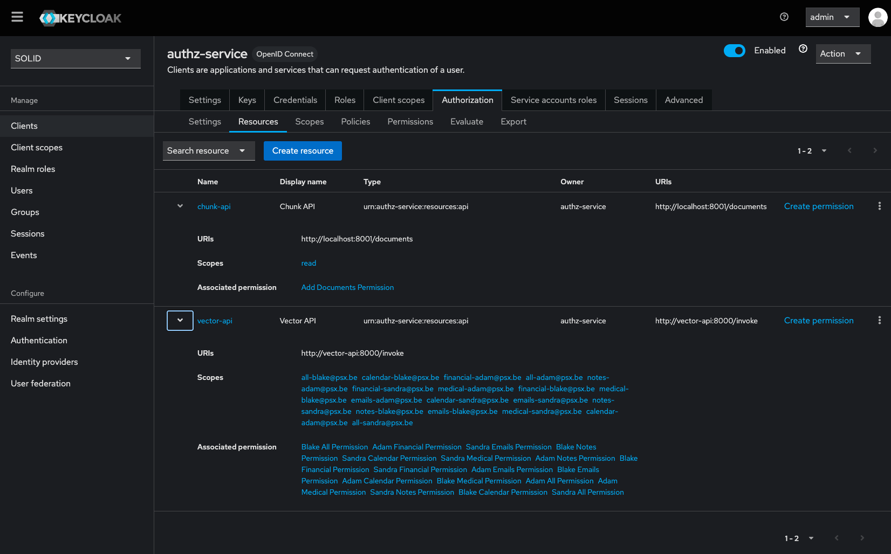

# Resources

The Keycloak resources can be configured for each client (`authz-service` in this setup).
The resources are configured with certain scopes and permissions (see [Policies, Scopes and Permissions](./scopes-and-policies.md))

_Keycloak resource overview of Authz-service_
