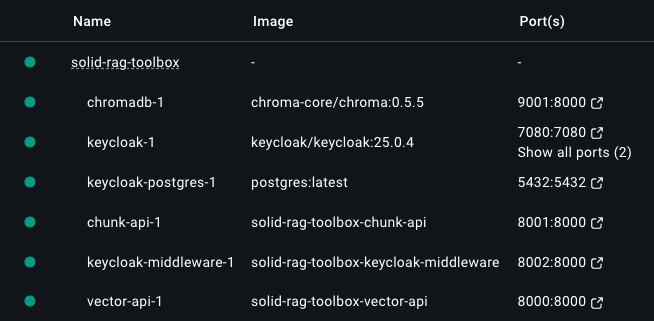

# Getting started

This setup is created for a demo project for PSX and FAIR. There are still some references present to have a basic setup of policies and user roles in keycloak. There are 3 personae: Adam, Blake and Sandra which have certain access rights on each others data. To add data for these personae see "Adding Data".

## Setup and starting services

All services contain a Dockerfile and can be build and run using Docker.
The following commands will build all the services (vector-api, chunk-api, keycloak-middleware),
start all dependecies (keycloak, postgres for keycloak, chromadb) and run the services.

```bash
docker compose -f docker-compose.yaml --profile service build

docker compose -f docker-compose.yaml --profile dependencies up -d

docker compose -f docker-compose.yaml --profile service up

```

**NOTE:**
Wait for the dependencies to be started before starting the services. Keycloak can take a few moments to startup and the keycloak-middleware service will try to access Keycloak when starting.

If all services are correctly started the docker services should look like this:



## Configuration

Each service has his own config file (`config.pkl`) in their folder which can be used to overwrite the default set in `Application.pkl`. These configs are configured by default to work together and the correct endpoints are configured for this docker setup.

An example of the config looks like this:

```pkl
amends "Application.pkl"

port = 8001
logLevel = "DEBUG"
chromadb = new ChromaDBConfig {
  host = "host.docker.internal"
  port = 8005
}
```

**NOTE:**
If you are unclear on these settings, do not change them so the setup works correctly.

### Keycloak manual configuration

Most of the configuration of Keycloak is added or created when starting the service based on the `realm-export.json` in the `keycloak-config` folder. This contains the SOLID realm, users, policies and permissions to be able to use the SOLID setup in this project. Not all settings can be added to this export, and have to be added manualy. This is the case for user passwords. Setting this up is described in the next chapter.