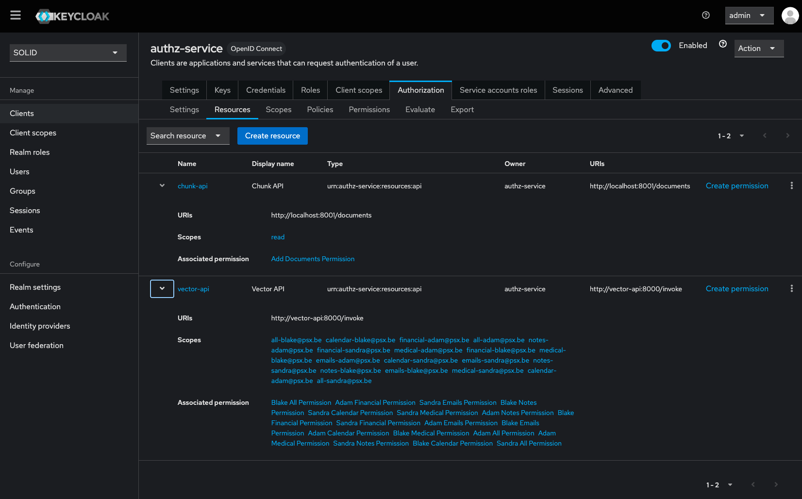

# Resources

The Keycloak resources can be configured for each client (`authz-service` in this setup).
The resources are configured with certain scopes and permissions. 

*Keycloak resource overview of Authz-service*
