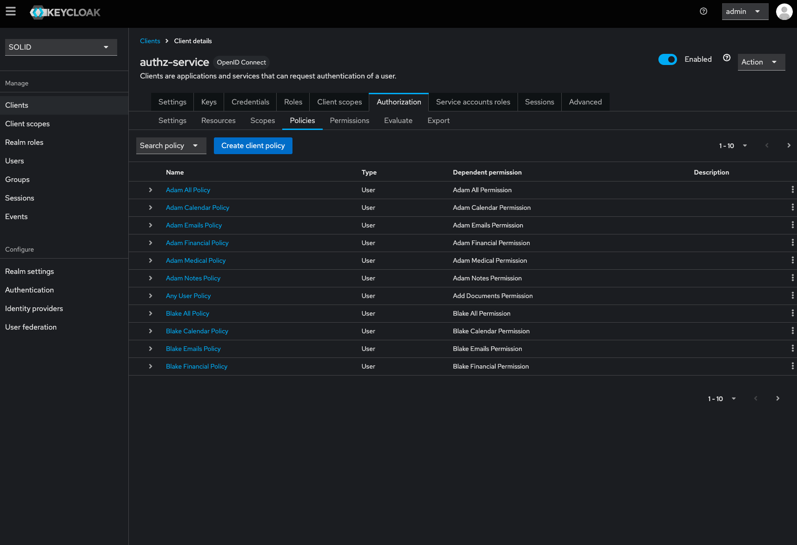
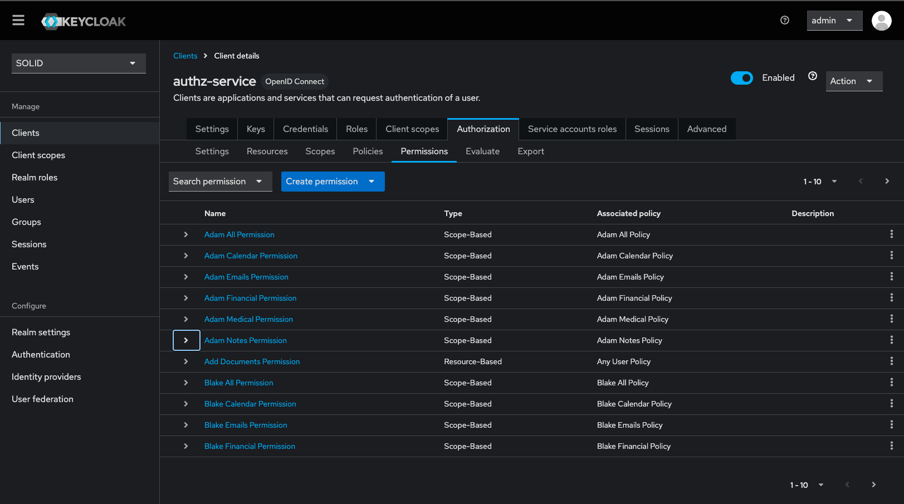

# Scopes, Policies and Permissions

In this setup the policies, scopes, permissions and resources are automatically created on startup of the Keycloak service. These are all focused on the use cases of our 3 personae (see [Introduction](../intro.md)).
For each of these users policies are created on diffent types of their personal data. The following if an overview of all the different policies that are created to access the data of Adam.

    * `calendar-adam@psx.be`: Access to Adam's calendar.
    * `financial-adam@psx.be`: Access to Adam's financial information.
    * `medical-adam@psx.be`: Accesss to Adam's medical information.
    * `emails-adam@psx.be`: Access to Adam's e-mails.
    * `notes-adam@psx.be`: Access to Adam's notes and todos.

All these different policies wil be created for each user. By default users have access on each other calendar, but not on any of the other types.

## Scopes

Scopes can be added to create a link between permissions/policies and resources for certain users. The scopes should be created first and will be used in the later steps when adding policies and permissions.

*Keycloak scopes overview of Authz-service*

## Policies

**TODO**

*Keycloak policies overview of Authz-service*

## Permissions

Permissions are scope-based to reflect the actual permissions of a user on a certain scope and policy. Permissions are linked to the policies.

*Keycloak permissions overview of Authz-service*
