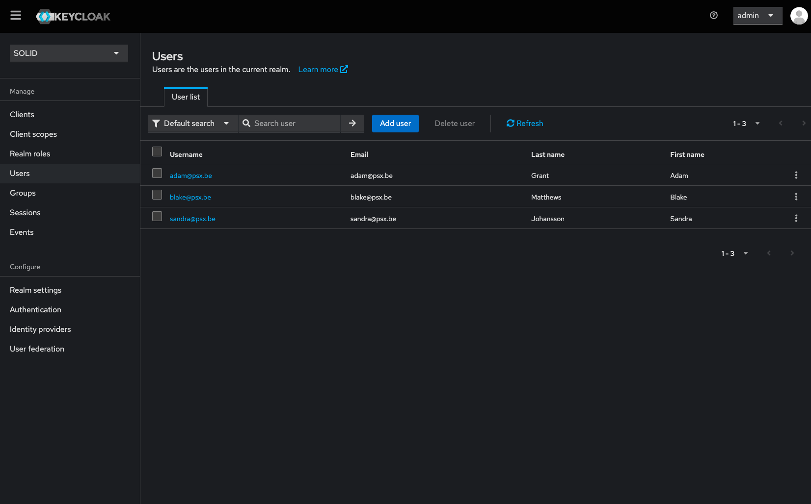
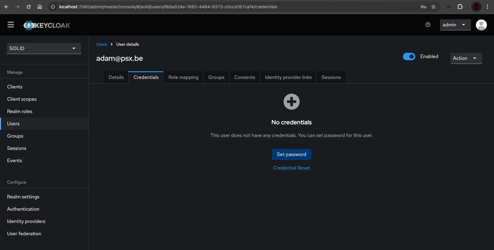

# Authentication

The SOLID RAG Toolbox uses Keycloak as an Authentication and Authorization Provider.
Keycloak configuration is automatically added on start of the service. Some information has to be filled in manually, this is the case for user passwords.

This toolbox has 3 per-configured users (Adam, Blake and Sandra) which will have an account created on Keycloak and policies/permission added to the user. To be able to login as one of these personae, their passwords should be set.

## Setup users

The instance of Keycloak can be accessed at `http://localhost:7080` when the service is running. Credentials to login as `admin` can be found (or set) in the `docker-compose.yaml` line 77-78 in the root of the project.

After logging in, make sure to select the SOLID realm at the top left. On the left side is a link to the overview of users. Here you can select a user you want to use and add a password in the `Credentials` tab.


*Keycloak users overview*


*Keycloak user detail*

## Request Access Token

To be able to add new data and to search for embeddings, an Access Token (JWT) is required. The token can be requested by calling to Keycloak with the credentials of the user you want to login as.

```bash
curl --location 'http://localhost:7080/realms/solid/protocol/openid-connect/token' \
--header 'Content-Type: application/x-www-form-urlencoded' \
--data-urlencode 'client_id=authz-service' \
--data-urlencode 'client_secret=not-very-secret' \
--data-urlencode 'grant_type=password' \
--data-urlencode 'username=adam@psx.be' \
--data-urlencode 'password=test123'
```

If the authentication is successful the response contains an `access_token`, expiration settings and a `refresh_token`. The Access Token will be used to store or request data.

## Add resources and policies

This is still a
**TODO**
