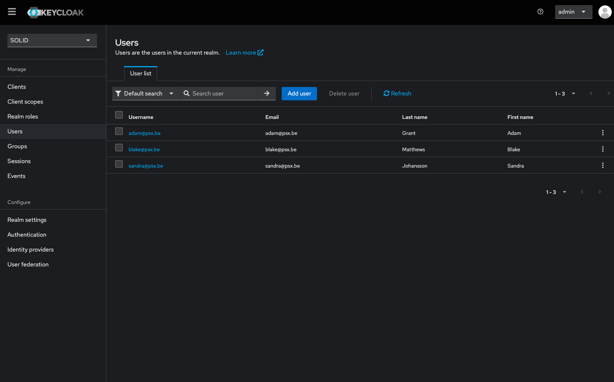
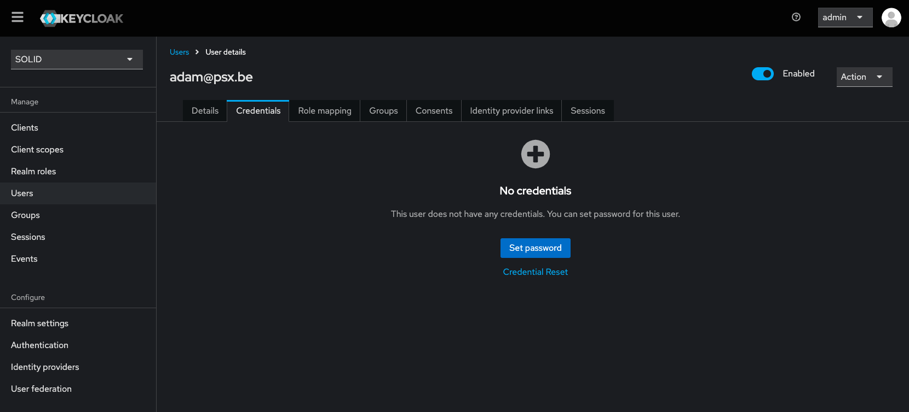

# Authentication and Authorization

The SOLID RAG Toolbox uses Keycloak as an Authentication and Authorization Provider.
Keycloak configuration is automatically added on start of the service. Some information has to be filled in manually, this is the case for user passwords.

This toolbox has 3 per-configured users (Adam, Blake and Sandra) which will have an account created on Keycloak and policies/permission added to the user. To be able to login as one of these personae, their passwords should be set.

## Setup users

The instance of Keycloak can be accessed at `http://localhost:7080` when the service is running. Credentials to login as `admin` can be found (or set) in the `docker-compose.yaml` > `keycloak` > `environments`.

After logging in, make sure to select the SOLID realm at the top left. On the left side is a link to the overview of users. Here you can select a user you want to use and add a password in the `Credentials` tab.


*Keycloak users overview*


*Keycloak user detail*

## Request Access Token

To be able to add new data and to search for embeddings, an Access Token (JWT) is required. The token can be requested by calling to Keycloak with the credentials of the user you want to login as.

```bash
curl --location 'http://localhost:7080/realms/solid/protocol/openid-connect/token' \
--header 'Content-Type: application/x-www-form-urlencoded' \
--data-urlencode 'client_id=authz-service' \
--data-urlencode 'client_secret=not-very-secret' \
--data-urlencode 'grant_type=password' \
--data-urlencode 'username=adam@psx.be' \
--data-urlencode 'password=test123'
```

If the authentication is successful the response contains an `access_token`, expiration settings and a `refresh_token`. The Access Token will be used to store or request data.

## Retrieve Data

To retrieve data using the middleware, the Access Token (JWT) is sent to the middleware.
The middleware verifies the necessary permissions for the requested resource and obtains an RPT (Requesting Party Token) to access the data.
This ensures that only authorized users can access the requested resources. For more details on how permissions are managed, see the [Understanding UMA](#understanding-uma) section.

## Understanding UMA

User-Managed Access (UMA) is a protocol that allows users to manage access to their resources. It involves defining resources, roles, policies, and permissions. 
After building this project, UMA should be set up. You can check and configure it via Keycloak by navigating to `SOLID realm > clients > authz-service > Authorization`.

### Resources, roles, policies and permissions
- **Resources** represent the data or services being protected.
- **Roles** define the different levels of access users can have.
- **Policies** specify the rules for granting access
- **Permissions** determine what actions can be performed on the resources.

For more details on the current access control setup for this project, refer to the [Access Control Setup](./../category/access-contol-setup) documentation.
